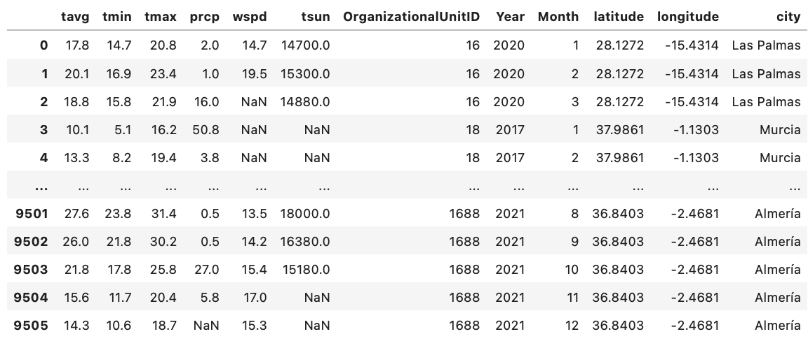

# ⛅️ Ingesting Weather Data with Meteostat

## **Task**: 
After assigning random locations (latitude, longitude, and city) to the different organizations, use the Meteostat Python library to ingest data for each available time period in the original data set.

**What is Meteostat?**: The Meteostat Python library provides simple access to open weather and climate data using Pandas. Historical observations and statistics are obtained from Meteostat's bulk data interface and consist of data provided by different public interfaces, most of which are governmental. Among the data sources are national weather services like the National Oceanic and Atmospheric Administration (NOAA) and Germany's national meteorological service (DWD).

**Location information**: I created a csv containing for the main Spanish cities, the latitude, the longitude and the name of the city. You can access the csv here: [latitude_longitude.csv](latitude_longitude.csv):

**Metrics ingested**:
  * tavg: The mean air temperature in °C
  * tmin: The mean minimum air temperature in °C
  * tmax: The mean maximum air temperature in °C
  * prcp: The mean monthly precipitation total in mm
  * wspd: The mean wind speed in km/h
  * tsun: The mean sunshine total in minutes (m)

**Files**:
 * [data.csv](data.csv): 
 * [latitude_longitude.csv](latitude_longitude.csv)
 * [weather_data.csv](weather_data.csv): 


## Installation

The Meteostat Python package is available through [PyPI](https://pypi.org/project/meteostat/):

```sh
pip install meteostat
```

Meteostat **requires Python 3.6** or higher. If you want to visualize data, please install Matplotlib, too.


## Weather Ingestion Function

The function I used to ingest data for the metrics over different time periods:

```python
def extract_weather(df):
    #initiate empty lists for the different indicators
    indexes=[]
    tavg=[]
    tmin=[]
    tmax=[]
    prcp=[]
    wspd=[]
    tsun=[]
    original_data = df[['longitude','latitude','Year','Month','OrganizationalUnitID']]
    for index, row in original_data.iterrows():
        #start is the first year, month and day of the reference period
        start = datetime(int(row['Year']), int(row['Month']), 1)
        
        #end is the last year, month and day of the reference period
        end = datetime(int(row['Year']), int(row['Month']), 1)
        
        #city is defined using the latitude and longitude
        city = Point(float(row['latitude']),float(row['longitude']))
        
        #we assemble all the row information: city, start day and end day
        #in our situation start = end
        weather_data = Monthly(city, start, end)
        weather_data = weather_data.fetch()
        weather_data = weather_data.iloc[:1].reset_index()
        
        #append all the unique indexes in index list
        indexes.append(index)
        
        #if we have no information for tavg for the row we put NaN, else we append to the metric list.
        if not np.any(weather_data['tavg']):
            tavg.append(np.NaN)
        else:  
            tavg.append(weather_data['tavg'][0])
            
        #if we have no information for tmin for the row we put NaN, else we append to the metric list.
        if not np.any(weather_data['tmin']):
            tmin.append(np.NaN)
        else:  
            tmin.append(weather_data['tmin'][0])
            
        #if we have no information for tmax for the row we put NaN, else we append to the metric list.
        if not np.any(weather_data['tmax']):
            tmax.append(np.NaN)
        else:  
            tmax.append(weather_data['tmax'][0])
            
        #if we have no information for prcp for the row we put NaN, else we append to the metric list.
        if not np.any(weather_data['prcp']):
            prcp.append(np.NaN)
        else:  
            prcp.append(weather_data['prcp'][0])
        
        #if we have no information for wspd for the row we put NaN, else we append to the metric list.
        if not np.any(weather_data['wspd']):
            wspd.append(np.NaN)
        else:  
            wspd.append(weather_data['wspd'][0])
            
        #if we have no information for tsun for the row we put NaN, else we append to the metric list.
        if not np.any(weather_data['tsun']):
            tsun.append(np.NaN)
        else:  
            tsun.append(weather_data['tsun'][0])
            
    #create a tuple including the list for all the meatrics
    weather_tuples = list(zip(indexes,tavg,tmin,tmax,prcp,wspd,tsun))
    
    #from this tuple we create a df that indicates for each id the metrics
    weather_df = pd.DataFrame(weather_tuples, columns=['id','tavg','tmin','tmax','prcp','wspd','tsun'])
    return weather_df
```

## Output:

The final output obtained after merging the weather data with the main df can be accessed [weather_data.csv](weather_data.csv). 

<p align="center">

</p>

